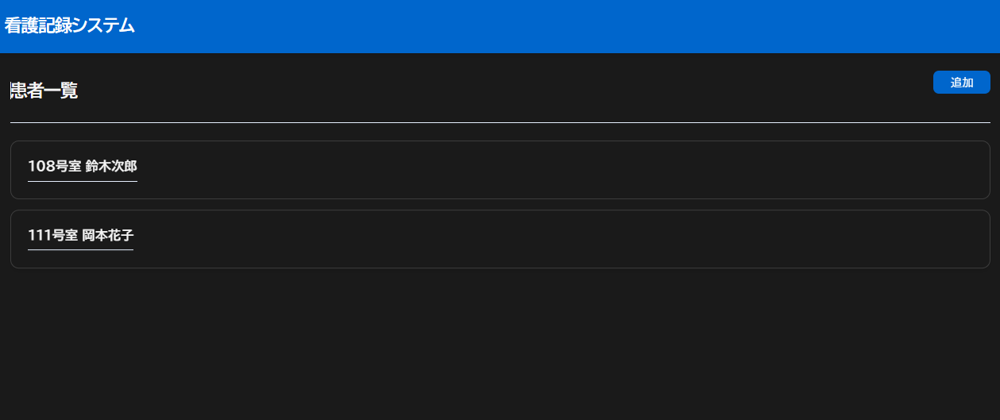
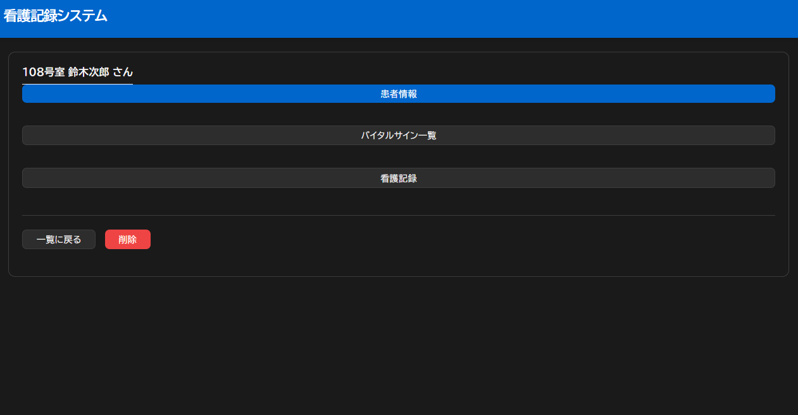
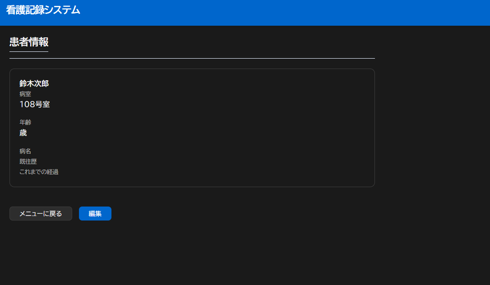
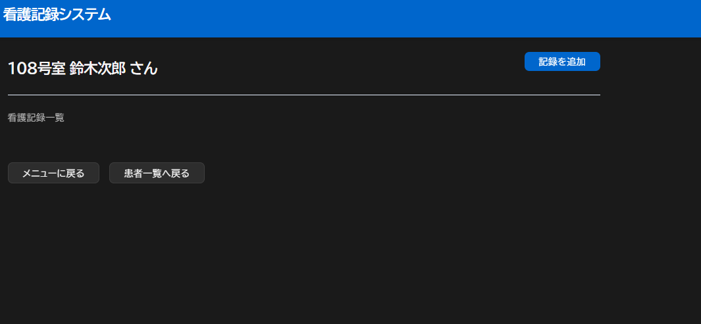
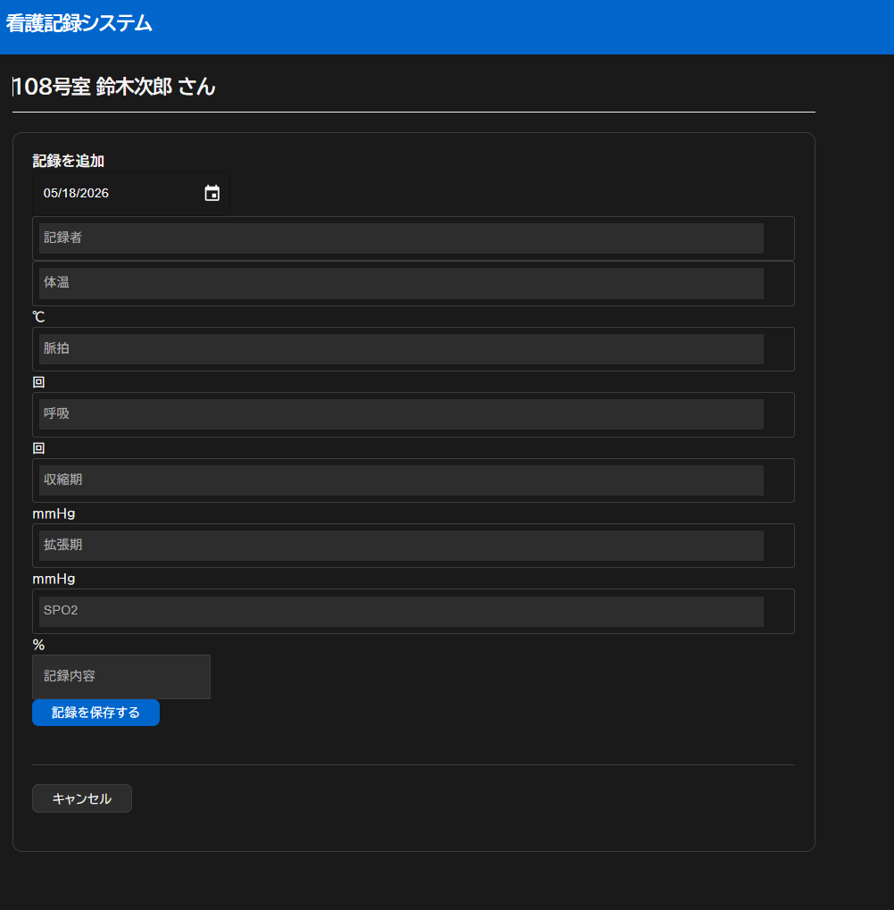

# 看護記録管理アプリ

## アプリ概要

患者情報と看護記録を管理できる看護師向けの記録管理アプリです。

患者ごとに看護記録やバイタル情報を確認でき、患者情報・看護記録の追加、表示、編集、削除ができます。

## 作成した理由

看護師として働く中で、患者情報や看護記録を効率よく管理する重要性を感じたため作成しました。

現場で扱う情報を、患者ごとに整理して確認できるようにすることを目的としています。

## 使用技術

- React
- JavaScript
- React Router
- React Hook Form
- Zod
- Express
- Node.js
- JSON file（簡易データ保存）

## 主な機能

### 患者情報

- 患者情報の追加
- 患者情報の表示
- 患者情報の編集
- 患者情報の削除

### 看護記録

- 看護記録の追加
- 看護記録の表示
- 看護記録の編集
- 看護記録の削除

### その他

- バイタル情報の管理
- フォームバリデーション
- 患者ごとの看護記録表示

## CRUD の流れ

```txt
画面操作
↓
App.jsx
↓
api/patientApi.js / api/recordApi.js
↓
server/index.js
↓
server/data.json
↓
React state 更新
↓
画面に反映
```

## API 一覧

| メソッド | URL               | 内容                     |
| -------- | ----------------- | ------------------------ |
| GET      | /api/data         | 患者情報・看護記録の取得 |
| POST     | /api/patients     | 患者追加                 |
| PUT      | /api/patients/:id | 患者更新                 |
| DELETE   | /api/patients/:id | 患者削除                 |
| POST     | /api/records      | 看護記録追加             |
| PUT      | /api/records/:id  | 看護記録更新             |
| DELETE   | /api/records/:id  | 看護記録削除             |

## 工夫した点

- 患者ごとに看護記録を紐づけて管理できるようにした
- React Router を使い、患者詳細・看護記録・バイタル画面への遷移を整理した
- React Router の URL パラメータ（/patient/:id）を使って対象患者を特定し、患者ごとの情報を表示できるようにした
- 患者情報と看護記録の state を App.jsx で一元管理し、画面ごとのデータ不整合が起きにくい構成にした
- Zod と React Hook Form を使って入力チェックを実装した
- Express API を使って、フロントエンドとバックエンドを分離した
- 以前は `PUT /api/data` で全体データをまとめて保存していたが、患者用 API と看護記録用 API に分割した
- API 通信後に React state を更新し、`server/data.json` への保存と画面反映を確認した

## セットアップ方法

依存パッケージをインストールします。

```bash
npm install
```

フロントエンドを起動します。

```bash
npm run dev
```

サーバーを起動します。

```bash
npm run api
```

## デプロイ

- フロントエンド: Vercel
- バックエンド: Render

現在は学習用として JSON file にデータを保存しています。
本番運用を想定する場合は、データベース連携を行う予定です。

## 画面イメージ

### 患者一覧画面



### 患者メニュー画面



### 患者情報画面



### 看護記録一覧画面



### 看護記録追加画面



## 今後の予定

- TypeScript 化
- データベース連携
- ログイン機能
