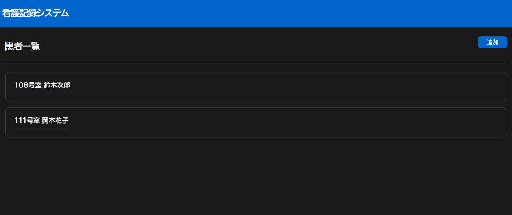
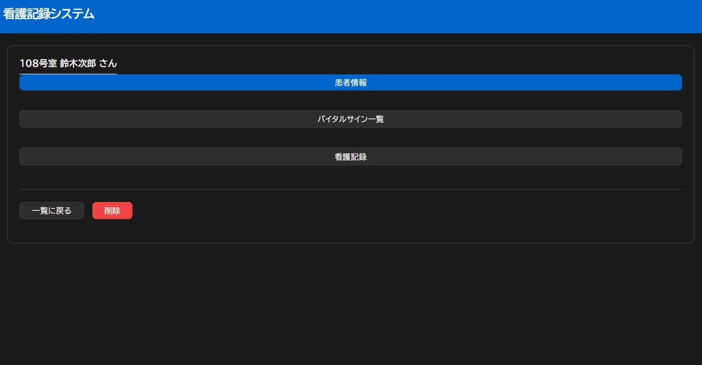
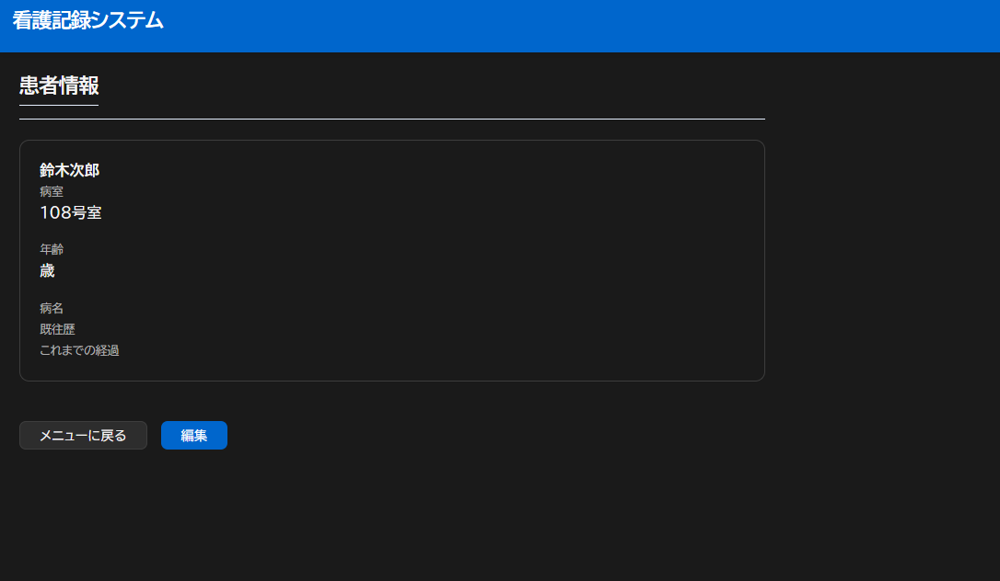
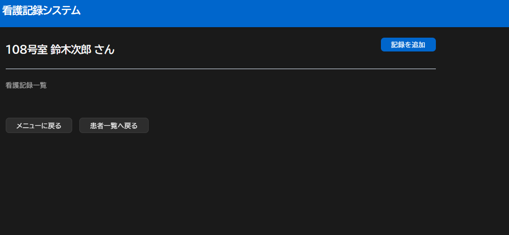
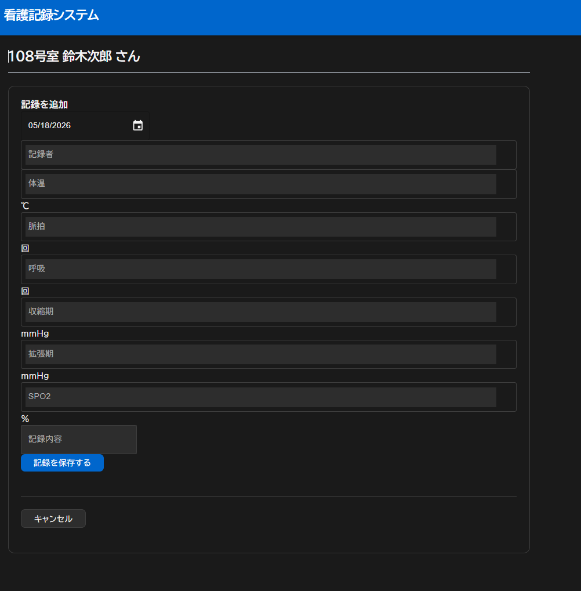

# 看護記録管理アプリ

## アプリ概要

患者情報・看護記録・バイタル情報を管理できる、看護師向けの記録管理アプリです。

ユーザーごとに患者データを分離し、ログインしたユーザーが自分の患者情報と看護記録を追加・閲覧・編集・削除できます。

**公開URL：https://nurse-apri.vercel.app**

> 学習・ポートフォリオ用のアプリです。動作確認には架空の情報を使用してください。
> 公開DBはRenderの無料プランを使用しており、現在のDBの有効期限は2026年11月9日です。

## 作成した理由

看護師として働く中で、患者情報や看護記録を効率よく管理する重要性を感じたため作成しました。

現場で扱う情報を患者ごとに整理し、必要な情報を確認しやすくすることを目的としています。

## 使用技術

### フロントエンド

- React
- TypeScript
- Vite
- React Router
- React Hook Form
- Zod
- MUI
- dayjs

### バックエンド・データベース

- Node.js
- TypeScript
- Express
- Prisma
- PostgreSQL
- bcryptjs
- jsonwebtoken
- cookie-parser
- cors

### テスト

- Vitest
- Testing Library
- Supertest

### デプロイ

- フロントエンド：Vercel
- バックエンド：Render
- データベース：Render PostgreSQL

## 主な機能

### 認証・データ分離

- ユーザーの新規登録
- ログイン・ログアウト
- bcryptによるパスワードのハッシュ化
- HttpOnly Cookieを使用したJWT認証
- 再読み込み後のログイン状態の復元
- ユーザーごとの患者・看護記録データの分離
- APIでの患者・看護記録の所有者確認

### 患者情報

- 患者情報の追加・表示・編集・削除
- 氏名・部屋番号による部分一致検索
- 氏名・部屋番号・年齢・疾患・既往歴・経過の管理
- 使用中の部屋番号の重複チェック

### 看護記録・バイタル

- 看護記録の追加・表示・編集・削除
- 患者ごとの看護記録表示
- 体温・脈拍・呼吸数・血圧・SpO2の管理

### フォーム・エラー処理

- Zodによる入力検証
- 保存中のボタン無効化
- 保存失敗時の入力内容保持
- APIエラーの表示

## データの流れ

```txt
画面操作
↓
Reactコンポーネント / App.tsx
↓
フロントエンドのAPI関数
↓
Express API
↓
認証・入力検証・所有者確認
↓
Prisma
↓
PostgreSQL
↓
APIから結果を返す
↓
Reactのstateを更新
↓
画面へ反映
```

## API一覧

| メソッド | URL | 内容 |
| --- | --- | --- |
| POST | /api/auth/register | ユーザー登録 |
| POST | /api/auth/login | ログイン |
| POST | /api/auth/logout | ログアウト |
| GET | /api/data | ログインユーザーの患者・看護記録取得 |
| GET | /api/patients | ログインユーザーの患者一覧取得 |
| POST | /api/patients | 患者追加 |
| PUT | /api/patients/:id | 患者更新 |
| DELETE | /api/patients/:id | 患者削除 |
| POST | /api/records | 看護記録追加 |
| PUT | /api/records/:id | 看護記録更新 |
| DELETE | /api/records/:id | 看護記録削除 |

患者・看護記録のAPIには認証が必要です。他のユーザーのデータへの操作を制限しています。

## TypeScript化で工夫した点

- 患者情報・看護記録・バイタルサインの型を共通化した
- API関数の引数と戻り値に型を設定した
- `Omit`を使い、登録・更新時に必要なデータを表現した
- `Pick`を使い、各コンポーネントが利用するOutlet Contextを明示した
- Zodの入力前と変換後を`z.input`と`z.output`で分けた
- React Hook Formに入力値と変換後データの型を設定した
- 保存結果を`Promise<T | undefined>`などで表現し、成功・失敗に応じて画面の処理を分けた
- 年齢の未入力を`null`として扱い、`??`を使用して0歳を保持した
- フロントエンドとバックエンドの両方を型チェックするようにした

## テスト

### フロントエンド

入力検証に加え、実際のフォーム操作や画面遷移を検証しています。

- 患者情報の必須項目・数値範囲・重複チェック
- 看護記録・バイタルの入力検証
- 患者追加フォームの表示・キャンセル
- 保存成功時のフォーム終了
- 保存失敗時の入力内容保持
- 氏名・部屋番号検索、検索クリア、部分一致検索
- 患者カードから詳細画面への遷移
- 患者編集フォームの初期値・保存・キャンセル

### API

Supertestのagentで2人のユーザーのCookieを保持し、認証と所有者の制限を検証しています。

`server/index.test.ts`は17件すべて成功しています。

- ログアウト後の保護APIへのアクセス拒否
- 他ユーザーの患者の取得・更新・削除制限
- 他ユーザーの患者への看護記録追加制限
- 他ユーザーの看護記録の更新・削除制限
- 不正な入力に対する400
- 存在しない患者・看護記録に対する404
- 患者一覧・患者と看護記録データの取得

### 実行コマンド

テストを一括実行します。

```bash
npm test
```

監視モードで実行します。

```bash
npm run test:watch
```

APIテストだけ実行します。

```bash
npx vitest run server/index.test.ts
```

型チェックを実行します。

```bash
npm run typecheck
```

Prisma Client生成・型チェック・フロントエンドの本番用ビルドを実行します。

```bash
npm run build
```

> APIテストはDBにテストデータを作成・削除します。開発用・テスト用DBで実行してください。

## セットアップ方法

### 1. 依存パッケージのインストール

```bash
npm install
```

### 2. 環境変数の設定

プロジェクト直下の`.env`に、利用するPostgreSQLの接続URLと認証用の秘密鍵を設定します。

```dotenv
DATABASE_URL=YOUR_POSTGRESQL_CONNECTION_URL
JWT_SECRET=YOUR_RANDOM_SECRET
VITE_API_BASE=http://localhost:3001/api
```

`DATABASE_URL`と`JWT_SECRET`の実際の値はGitに登録しないでください。
`VITE_`で始まる変数はフロントエンドに公開されるため、秘密情報を設定しません。

秘密鍵は次のコマンドで生成できます。

```bash
node -e "console.log(require('node:crypto').randomBytes(32).toString('hex'))"
```

### 3. Prisma Client生成・マイグレーション適用

接続先を確認してから実行します。

```bash
npx prisma generate
npx prisma migrate deploy
```

### 4. 起動

フロントエンドを起動します。

```bash
npm run dev
```

別のターミナルでAPIサーバーを起動します。

```bash
npm run api
```

開発画面：http://localhost:5173

初回は新規登録画面でアカウントを作成してください。

## デプロイ設定

### Vercel

- Build Command：`npm run build`
- Output Directory：`dist`
- 環境変数：`VITE_API_BASE=https://nurse-apri.onrender.com/api`

React Routerのページへ直接アクセス・再読み込みできるよう、`vercel.json`で`index.html`へのrewriteを設定しています。

### Render Web Service

- Build Command：`npm install && npx prisma generate && npx prisma migrate deploy`
- Start Command：`npm run api`
- 環境変数：`DATABASE_URL`・`JWT_SECRET`・`NODE_ENV=production`
- `DATABASE_URL`には、同じSingaporeリージョンのRender PostgreSQLのInternal Database URLを使用

### 公開環境の認証設定

- CORSで`https://nurse-apri.vercel.app`を許可
- フロントエンドのAPI通信に`credentials: "include"`を指定
- 本番の認証Cookieに`HttpOnly`・`Secure`・`SameSite=None`を指定
- ログアウト時も同じCookie設定で削除

## 公開環境の動作確認

2026年10月10日に、架空のデータを使用して確認しました。

| 確認項目 | 結果 |
| --- | --- |
| 新規登録・ログイン | 成功 |
| ページの直接アクセス・再読み込み | 成功 |
| 再読み込み後のログイン維持 | 成功 |
| ログアウト・再読み込み後の状態維持 | 成功 |
| 患者の追加・編集・削除 | 成功 |
| 看護記録・バイタルの追加・編集 | 成功 |
| 看護記録の削除 | 成功 |
| 保存・削除結果の再読み込み後の反映 | 成功 |
| 氏名・部屋番号検索、検索クリア | 成功 |
| アカウントAとBの患者一覧の分離 | 成功 |

## 画面イメージ

### 患者一覧画面



### 患者メニュー画面



### 患者情報画面



### 看護記録一覧画面



### 看護記録追加画面



## 今後の予定

- APIの正常な更新・削除処理のテスト拡充
- `/api/data`でのユーザー間のデータ分離テスト追加
- 入力エラーの詳細表示の改善
- 最新画面に合わせたスクリーンショット更新
- 管理者・一般ユーザーなどの役割に応じた権限管理の検討
- 公開DBの継続利用方法の整備